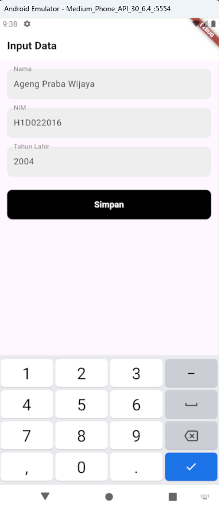
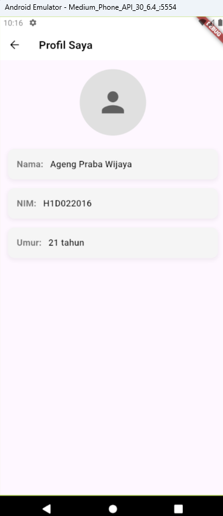

# Proses Passing Data dari `FormData` ke `TampilData`

Dokumen ini menjelaskan cara melakukan passing data dari layar `FormData` ke layar `TampilData` dalam aplikasi Flutter. Pengguna akan mengisi **Nama**, **NIM**, dan **Tahun Lahir** pada layar `FormData`, kemudian data tersebut akan ditampilkan di layar `TampilData` menggunakan mekanisme navigasi dan pengiriman data.

## 1. Mengumpulkan Data Input di `FormData`

Pada widget `FormData`, pengguna mengisi tiga field yaitu `nama`, `nim`, dan `tahun`. Setiap field ini diwakili oleh objek `TextEditingController`. Setelah pengguna menekan tombol **Simpan**, data yang dimasukkan akan ditangkap.

Berikut penjelasannya:

```dart
final _namaController = TextEditingController();
final _nimController = TextEditingController();
final _tahunController = TextEditingController();
```

Setiap TextField dihubungkan dengan controller-nya masing-masing:

```dart
TextField(
  controller: _namaController,
  decoration: InputDecoration(
    labelText: "Nama",
  ),
);
```

Ketika pengguna menekan tombol Simpan, callback onPressed akan dijalankan untuk menangkap data dari controller:

```dart
onPressed: () {
  String nama = _namaController.text;
  String nim = _nimController.text;
  int tahun = int.parse(_tahunController.text);

  Navigator.of(context).push(MaterialPageRoute(
    builder: (context) => TampilData(nama: nama, nim: nim, tahun: tahun),
  ));
}
```

Penjelasan :

- Navigator.of(context).push() digunakan untuk navigasi dari FormData ke TampilData.
- MaterialPageRoute digunakan untuk membuat route baru yang menampilkan widget TampilData.
- Data (nama, nim, tahun) dikirim ke konstruktor TampilData.

## 2 Menerima Data di `TampilData`

Pada widget `TampilData`, konstruktor menerima data yang dikirim dari `FormData`:

```dart
class TampilData extends StatelessWidget {
  final String nama;
  final String nim;
  final int tahun;

  const TampilData({
    Key? key,
    required this.nama,
    required this.nim,
    required this.tahun,
  }) : super(key: key);
}

```

Widget `TampilData` membutuhkan tiga parameter (`nama`, `nim`, dan `tahun`). Nilai-nilai ini kemudian digunakan untuk menampilkan informasi profil pengguna.

Setelah data yang diterima, program akan menghitung umur dan menampilkannya bersama dengan nama dan NIM:

```
final int umur = DateTime.now().year - tahun;

Text("Nama: $nama"),
Text("NIM: $nim"),
Text("Umur: $umur tahun"),

```

## Screenshots

<br>

